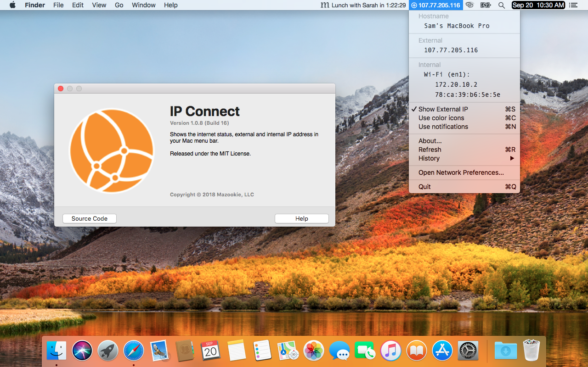

# IP Connect 

Shows the internet status, external and internal IP address in your Mac menu bar. Get up to date connection notifications when the status changes.

- Icons in color or black and white.
- Show external IP on menubar.
- Use system notifications of changes.

## Screenshots

## Versions
>[1.0.8](builds/IPConnect_v1.0.8/IPConnect.zip)
>    Changes:
>    - First Open Source Release

## Support

**Bugs and requests?**  Please use the project's [issue tracker].

**Want to contribute?**  Please fork this repository and open a pull request with your new changes.

**Do you like it?**  Support the project by starring the repository or [tweet] about it.

## Thanks for looking! If you like what you see 

**IP Connect** © 2022, Mazookie, LLC. Released under the [MIT License](LICENSE).

[tweet]: https://twitter.com/intent/tweet?
[issue tracker]: https://github.com/pawong/IPConnect/issues/new

Q: What is Mazookie?

A: Mazookie is a company that used to put apps on the MacOS App Store. This doesn't happen any more because Apple charges money to be a developer and there's no money in these apps, so the projects have been opensourced. Yeah, free stuff!
